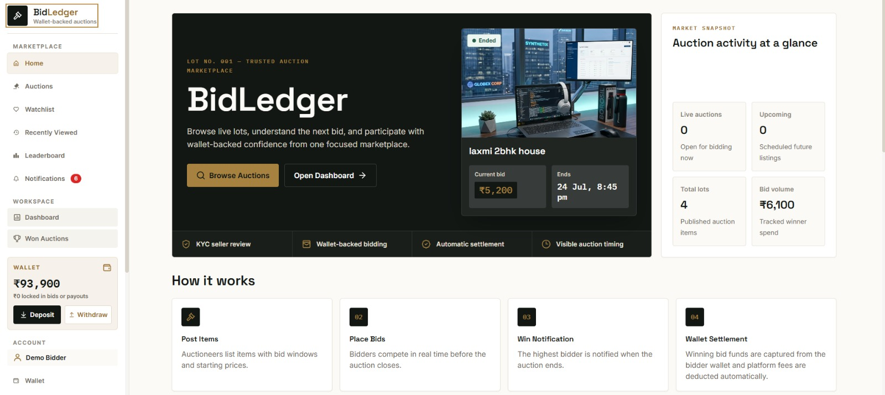
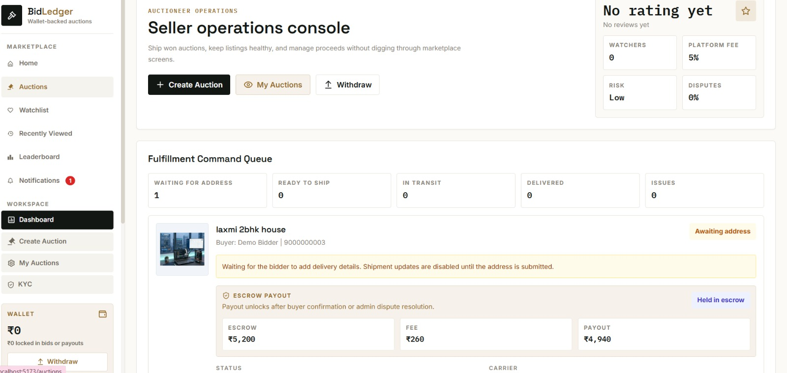
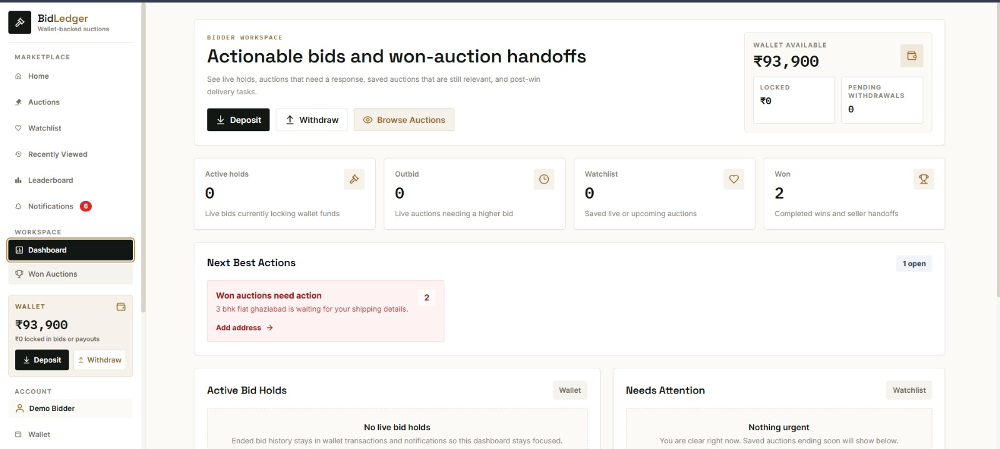
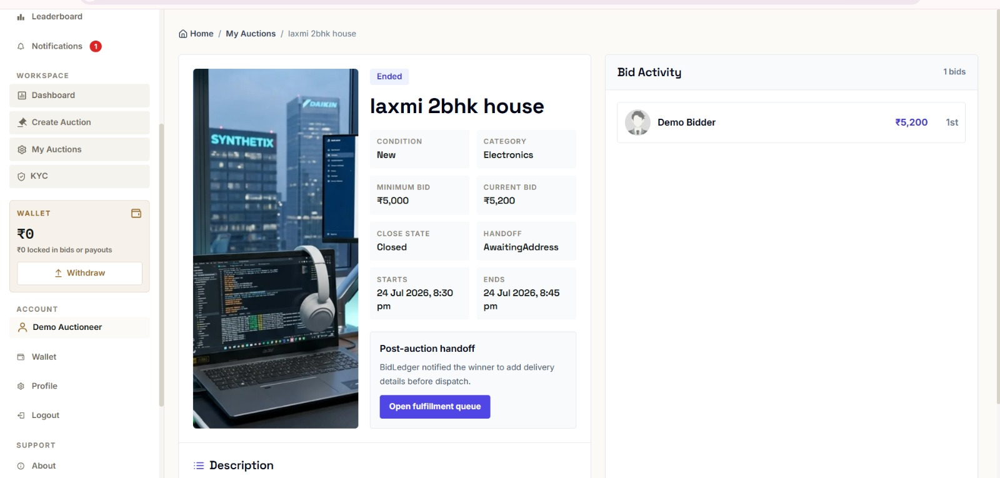
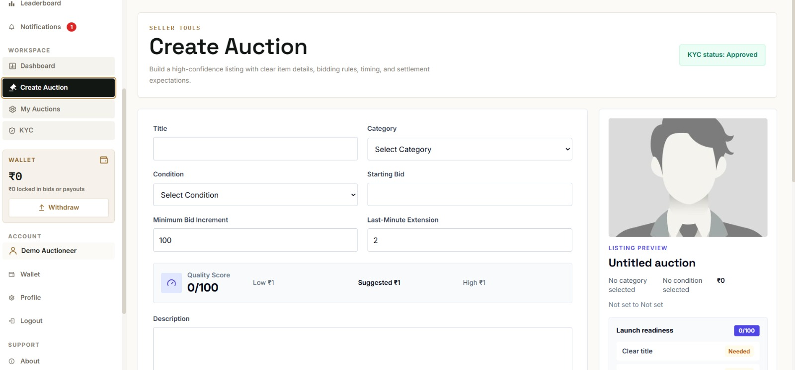
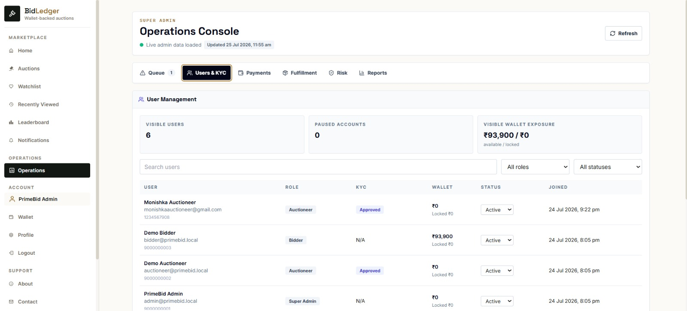

# BidLedger

> Full-stack MERN auction marketplace with KYC-gated selling, wallet-backed bidding, secure image storage, automated auction settlement, and role-based dashboards.


## Live Demo

🔗 **App:** https://bid-ledger.vercel.app
🔗 **API:** https://bidledger.onrender.com/health

> **Note:** the backend is hosted on Render's free tier, which spins down after periods of inactivity. If the site has been idle, the first request can take 30-60 seconds to respond while the server wakes up — this is expected, not a bug. Subsequent requests are fast.

Try the **Try Demo** button on the login page for instant access to a sandboxed bidder/auctioneer/admin walkthrough without creating an account, or sign up for the full KYC → auction → bid flow.

This public repository is a clean sharing and deployment copy. It intentionally contains no real `.env` files, no local secrets, no `node_modules`, and no generated frontend `dist` output.

## Highlights

- 67 REST API endpoints across 7 route groups
- 155 automated tests (backend + frontend), all passing
- 8 MongoDB compound/unique indexes for query performance
- 3 user roles: Bidder, Auctioneer (Seller), Super Admin
- Google OAuth + JWT authentication
- Cloudinary image storage with automatic local fallback
- Wallet-backed bidding with automatic commission settlement
- Gemini-powered listing assistant

## Why BidLedger?

BidLedger was built to simulate the architecture of a real online marketplace rather than a CRUD demo. It focuses on the parts that make an auction platform trustworthy: KYC-gated selling, wallet-backed bidding so users can't bid money they don't have, automatic commission settlement on close, escrow-held payouts released only on delivery confirmation, and clean separation between bidder, seller, and admin roles and permissions.

## Screenshots

| Landing Page | Seller Dashboard |
|---|---|
|  |  |

| Bidder Dashboard | Auction Details |
|---|---|
|  |  |

| Create Auction | KYC Admin Review |
|---|---|
|  |  |

## Features

🏷 **Core Marketplace**
- Live auction listings with search, category/condition filters, and sorting
- Real-time bid sync via an EventEmitter-based pub/sub layer (`GET /auction/:id/sync`, `/stream`) — bidders see new bids without a manual refresh
- Auto-bidding (set a max, the system bids on your behalf up to that ceiling)
- Watchlist, recently viewed, and a bid-volume leaderboard

🔐 **Authentication & Security**
- JWT authentication + Google Sign-In (Google Identity Services)
- Role-based authorization and protected routes
- `express-validator` request validation on auth, auction creation, and bidding

🛡 **Seller Experience**
- KYC verification (ID proof + selfie upload, admin approval) gating who can list auctions
- Auction drafts
- Seller operations console — fulfillment queue, reputation, escrow/payout breakdown

💰 **Bidder Experience**
- Wallet-backed bidding with automatic platform commission settlement on auction close
- Bid history, won auctions, wallet transactions
- Winner handoff: delivery address collection, seller shipment updates, dispute reporting

⚙ **Administration**
- KYC approval workflow
- User management
- Platform operations center

🤖 **AI**
- Gemini-powered listing assistant (draft cleanup, category suggestion) and smart auction recommendations

## Verified Features

Every item below was manually tested end-to-end during development, not just covered by unit tests:

- ✅ Signup (with profile image upload)
- ✅ Login (email/password)
- ✅ Google OAuth login
- ✅ KYC submission
- ✅ Admin KYC approval
- ✅ Auction creation
- ✅ Bid placement
- ✅ Cloudinary image uploads
- ✅ Live bid synchronization

## Tech Stack

| Layer | Technology |
|---|---|
| Frontend | React (Vite), Redux Toolkit, Tailwind CSS, Chart.js |
| Backend | Node.js, Express |
| Database | MongoDB / Mongoose |
| Auth | JWT, Google Identity Services |
| Media | Cloudinary (optional, with local fallback) |
| AI | Google Gemini |
| Validation | express-validator |

## Architecture

```text
                 React + Redux Toolkit
                          │
              JWT  /  Google OAuth
                          │
                  Express.js API
                          │
             express-validator middleware
                          │
              Controllers / Route handlers
        ┌─────────────────┼──────────────────┐
        │                 │                  │
    MongoDB          Cloudinary          Gemini API
   (Mongoose)     (image storage,      (listing assistant,
                    optional)           recommendations)
        │
  Auction Engine
        │
  Wallet + Escrow
        │
  EventEmitter Sync ──▶ polling / SSE ──▶ connected clients
```

## Workflow

```text
Register ──▶ Upload profile image ──▶ Submit KYC (Auctioneer)
   │
   ▼
Admin reviews & approves KYC
   │
   ▼
Auctioneer creates auction ──▶ Bidders place bids / set auto-bid
   │
   ▼
Auction ends ──▶ Winner declared ──▶ Commission settled
   │
   ▼
Delivery address submitted ──▶ Shipment updates ──▶ Delivery confirmed
   │
   ▼
Escrow released to seller
```

## Database Collections

| Collection | Purpose |
|---|---|
| Users | Accounts, roles, KYC status, wallet balance |
| AuctionItems | Listings, bid history, schedule, status |
| Bids | Individual bid records |
| Wallets / Transactions | Balance changes, commission, payouts |
| Fulfillment | Delivery address, shipment status, disputes |
| Notifications | User-facing alerts |

## Security

- JWT authentication with HTTP-only cookies
- Google OAuth (Google Identity Services)
- Role-based access control (Bidder / Auctioneer / Super Admin)
- `express-validator` request validation on auth, auction, and bid routes
- KYC verification gating who can list auctions
- Environment-based configuration — no secrets committed to the repo

## Performance

- Compound and unique MongoDB indexes on frequently queried fields (auction status/end time, user email/phone)
- Lazy-loaded frontend routes (per-page code splitting via Vite)
- Optimized image delivery through Cloudinary when configured
- Event-driven auction synchronization instead of constant polling from every client

## Roadmap

Ideas for future iterations — not yet implemented:

- [ ] WebSocket-based live bidding (current real-time sync uses polling/SSE)
- [ ] Payment gateway integration for real money movement
- [ ] Email notifications for outbid/won/ending-soon events
- [ ] Auction analytics dashboard
- [ ] Mobile application

## Project Structure

```text
backend/   Express API, MongoDB models, wallet/auction/fulfillment logic
frontend/  Vite React app
docs/      Product and implementation notes
```

## Local Setup

Backend:

```bash
cd backend
npm install
cp .env.example .env
npm run dev
```

Frontend:

```bash
cd frontend
npm install
cp .env.example .env
npm run dev
```

Default local URLs:

- Frontend: `http://localhost:5173`
- Backend API: `http://localhost:8000/api/v1`

### Seed demo data

To skip manual signup/KYC and get straight to testing:

```bash
cd backend
npm run seed:demo   # pre-approved Auctioneer + funded Bidder + Super Admin
npm run seed:admin  # just the Super Admin, if you already have other accounts
```

## Required Environment Variables

Set local values in `.env` files and deployment values in the hosting provider dashboard. Do not commit real `.env` files.

Backend essentials:

```bash
NODE_ENV=production
MONGODB_URL=mongodb+srv://...
JWT_SECRET=replace-with-a-long-random-secret
COOKIE_EXPIRE=7
COOKIE_SECURE=true
CLIENT_URL=https://your-frontend-domain
FRONTEND_URL=https://your-frontend-domain
CRON_SECRET=replace-with-a-long-random-secret
GOOGLE_CLIENT_ID=your-google-client-id.apps.googleusercontent.com
AI_FEATURES_ENABLED=true
GEMINI_MODEL=gemini-2.0-flash
GEMINI_API_KEY=your-gemini-api-key

# Optional — enables Cloudinary image storage; without these, images
# are stored as base64 data URLs instead.
CLOUDINARY_CLOUD_NAME=your-cloud-name
CLOUDINARY_API_KEY=your-cloudinary-api-key
CLOUDINARY_API_SECRET=your-cloudinary-api-secret
```

Frontend essentials:

```bash
VITE_API_BASE_URL=https://your-backend-domain/api/v1
VITE_GOOGLE_CLIENT_ID=your-google-client-id.apps.googleusercontent.com
```

## API Overview

67 routes across 7 route groups. A representative sample:

| Method | Endpoint | Description |
|---|---|---|
| POST | `/api/v1/user/register` | Create an account (validated) |
| POST | `/api/v1/user/login` | Email/password login |
| POST | `/api/v1/user/google-login` | Google Identity Services login |
| POST | `/api/v1/user/kyc` | Submit KYC documents (Auctioneer) |
| POST | `/api/v1/auctionitem/create` | Create an auction (KYC-gated, validated) |
| GET | `/api/v1/auctionitem/auction/:id/sync` | Poll for auction state changes |
| GET | `/api/v1/auctionitem/auction/:id/stream` | Server-sent event stream for live updates |
| POST | `/api/v1/bid/place/:id` | Place a bid (validated) |
| PUT | `/api/v1/bid/auto/:id` | Set/update an auto-bid ceiling |
| GET | `/api/v1/wallet/*` | Wallet balance and transaction history |

## Verification

```bash
cd backend
npm test

cd ../frontend
npm test
npm run lint
npm run build
```

## Deployment

See [DEPLOYMENT.md](DEPLOYMENT.md) for Vercel, Render, and Netlify deployment notes.

Recommended free demo setup:

1. MongoDB Atlas free cluster.
2. Vercel or Netlify for the frontend.
3. Vercel or Render for the backend.
4. Cloudinary free tier for image storage (optional — falls back to base64 without it).

For real auctions, use a reliable scheduler for `/api/v1/cron/all` so ended auctions settle promptly.